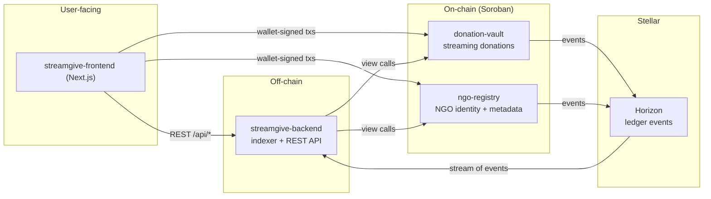

# Architecture

StreamGive is composed of four components that ship independently but
operate as one system. A new contributor reading each component's
README individually has to reconstruct the picture themselves; this
document shows it in one place.

## System overview

## The four components

### `ngo-registry` (Soroban contract)

Owns the canonical list of NGOs. Registers an NGO's address, display
name, jurisdiction, and payout destination. `donation-vault` trusts
`ngo-registry` for identity: a stream can only be opened toward an NGO
that the registry recognises. Admin-gated writes; public reads.

### `donation-vault` (Soroban contract)

Holds donor funds and streams them to an NGO at a fixed rate per second.
Owns the `Stream` struct and the full lifecycle: `create_stream`,
`withdraw`, `top_up`, `modify_rate`, `cancel_stream`. Emits one event
per state-changing call; see `docs/EVENTS.md` for the topic/data schema.

### `streamgive-backend` (Node / TypeScript)

Two jobs, both off-chain:

1. **Indexer** — tails Horizon for `donation-vault` and `ngo-registry`
   events and materialises them into a queryable store.
2. **REST API** — serves the frontend: current streams by NGO, historical
   donation totals, NGO metadata, and health endpoints.

### `streamgive-frontend` (Next.js)

The user-facing app. Connects a Stellar wallet, reads NGO metadata from
the backend, and lets donors open, top up, and cancel streams by signing
Soroban transactions directly against the contracts. It never touches a
private key or the blockchain's raw RPC; signing is delegated to the
wallet extension.

## Data flow: a donation, end to end

1. Donor opens the frontend, connects Freighter (or another wallet), and
   picks an NGO from the backend's list.
2. Frontend builds a `create_stream` transaction against `donation-vault`
   and hands it to the wallet to sign.
3. Wallet signs and submits. The contract pulls the deposit, stores the
   `Stream`, and emits `("created", stream_id)`.
4. Horizon picks up the event. `streamgive-backend`'s indexer reads it,
   updates its store, and the NGO's live donation total goes up.
5. The NGO periodically calls `withdraw`. The contract releases the
   accrued amount, skims the protocol fee if configured, and emits
   `("withdraw", stream_id)`.
6. If the donor cancels, `cancel_stream` settles accrual to the NGO,
   refunds the untouched remainder to the donor, and emits
   `("cancel", stream_id)`.

## Where each piece of state lives

| Data | Lives in | Notes |
|---|---|---|
| NGO registry (addresses, names) | `ngo-registry` contract | Public, admin-written |
| Stream state (balance, rate, status) | `donation-vault` contract | One `Stream` per id |
| Historical events | Horizon | Indexed by `streamgive-backend` |
| Queryable projections | `streamgive-backend`'s store | Postgres or SQLite |
| User session / wallet | Frontend (browser) | Never leaves the client |

## Getting started

Each component has its own README with build and test instructions:

- `ngo-registry` — `contracts/ngo-registry/`
- `donation-vault` — `contracts/donation-vault/` (see also `docs/STORAGE.md`, `docs/EVENTS.md`)
- `streamgive-backend` — `streamgive-backend/`
- `streamgive-frontend` — `streamgive-frontend/`

For testnet deployment, `scripts/deploy-testnet.sh` wires both contracts
and writes the resulting addresses to `deployments.json`.

