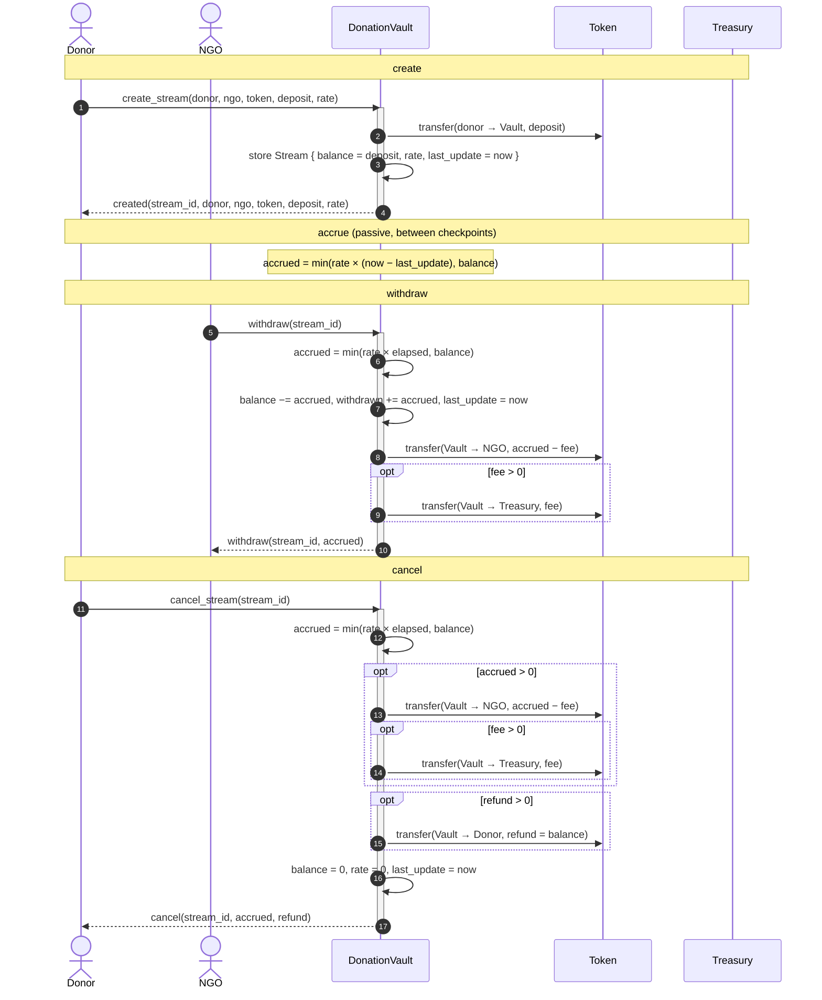
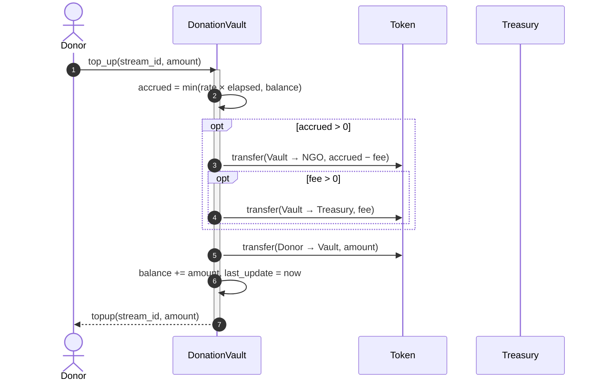
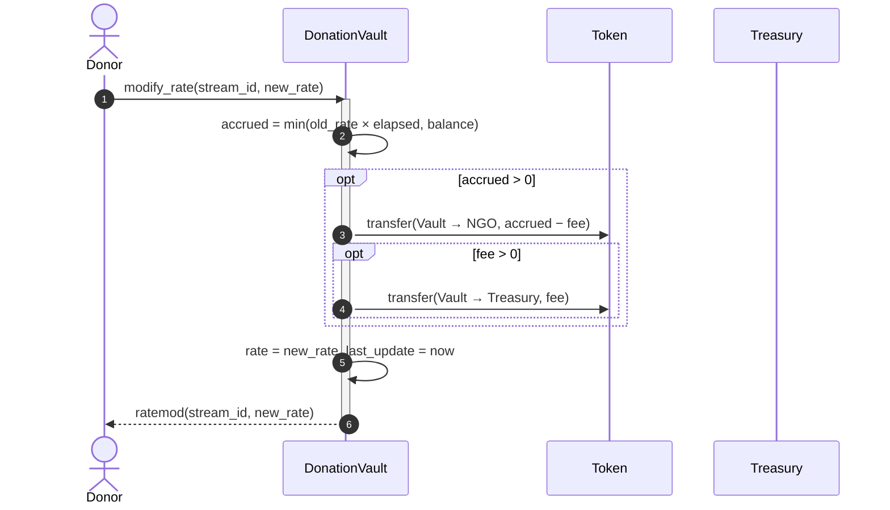
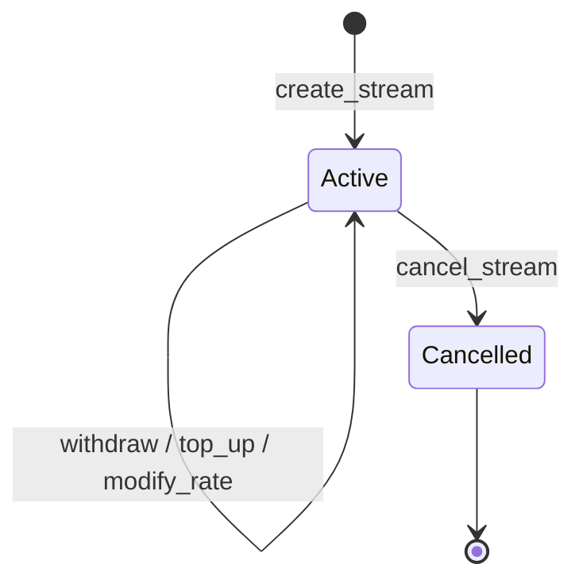

# Stream lifecycle

This document walks through the life of a `donation-vault` stream: how it is
created, how it accrues, how the NGO withdraws, how the donor cancels, and how
the `top_up` / `modify_rate` forks slot in. It complements
[`EVENTS.md`](./EVENTS.md), which lists the events each step emits, and
[`STORAGE.md`](./STORAGE.md), which explains the storage and TTL layout.

## Actors

| Actor | Role |
| --- | --- |
| `Donor` | Funds the stream and can top it up, change its rate, or cancel it. |
| `NGO` | Receives the accrued funds and authorizes withdrawals. |
| `DonationVault` | Holds the deposit and streams it to the NGO over time. |
| `Token` | The Stellar asset contract (SAC) the stream is denominated in. |
| `Treasury` | Optional recipient of the protocol fee, only used if configured. |
| `Admin` | Can pause/unpause the vault and configure the fee/treasury; not part of the per-stream flow. |

Key concepts:

- A stream stores `balance` (undrawn deposit), `rate` (units per second),
  `created_at` (fixed) and `last_update` (moves on every checkpoint).
- Nothing moves between checkpoints: accrual is computed lazily as
  `min(rate × elapsed, balance)` (see `math::accrued`).
- Every payout is checkpointed, so `last_update` always marks the last time the
  stream was settled.

## Happy path: create → accrue → withdraw → cancel

Notes:

- `withdraw` requires the **NGO's** auth; `create_stream`, `top_up`,
  `modify_rate` and `cancel_stream` require the **donor's** auth.
- A stream with nothing accrued reverts `withdraw` with
  `Error::NothingToWithdraw`; `cancel_stream` on such a stream just refunds the
  whole balance.
- The fee is only taken when a treasury is configured; with no treasury the NGO
  receives the full amount (see `pay_ngo`).
- The stream record is kept (not deleted) after `cancel_stream`; it simply ends
  with `balance = 0` and `rate = 0`.

## Fork: top-up

A donor can add more funds to a live stream. The stream is settled first, so
the new funds only ever affect accrual going forward.

## Fork: modify-rate

A donor can change the per-second rate. The old rate is settled first, so the
new rate is never applied retroactively.

## Lifecycle states

`Active` is the normal state and `Cancelled` is terminal. `pause` / `unpause`
(admin-only) block `create_stream`, `withdraw`, `top_up` and `modify_rate`
globally, but deliberately leave `cancel_stream` available so donors can always
recover their remaining funds.

## See also

- [`EVENTS.md`](./EVENTS.md) — every event in this flow, with topics and data.
- [`STORAGE.md`](./STORAGE.md) — where stream state lives and how TTLs are bumped.
- [`../contracts/donation-vault/src/lib.rs`](../contracts/donation-vault/src/lib.rs) — the entry points.
- [`../contracts/donation-vault/src/math.rs`](../contracts/donation-vault/src/math.rs) — the accrual math.
